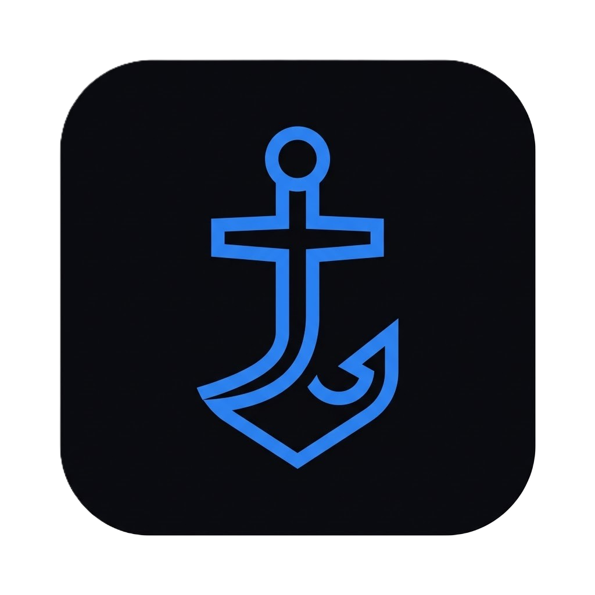

> [!IMPORTANT]
> **Active Fork Notice:** This repository is a fork of the original [Shipyard](https://github.com/defremont/Shipyard) by **defremont**. 
> It is maintained by **awilliansd** to include new features, bug fixes, and improvements that are not present in the upstream version.

---

<p align="center">
  
</p>

<h1 align="center">Dockyard</h1>

<p align="center">
  Local development dashboard &mdash; manage projects, tasks, git, and terminals from your browser.
</p>

<p align="center">
  <a href="https://github.com/awilliansd/dockyard/releases/latest"></a>
  <a href="https://github.com/awilliansd/dockyard"></a>
  
  
  
  
</p>

---

<p align="center">
  <a href="https://github.com/awilliansd/dockyard/releases/latest"></a>&nbsp;
  <a href="https://github.com/awilliansd/dockyard/releases/latest"></a>&nbsp;
  <a href="https://github.com/awilliansd/dockyard/releases/latest"></a>
</p>

<p align="center">
  
</p>

## Why Dockyard

- **Local-first** -- runs entirely on `localhost`. No cloud services, no accounts, no telemetry. Your data stays on your machine as plain JSON files.
- **Complements your editor** -- Dockyard is not an IDE. It sits alongside VS Code (or whatever you use) and gives you a bird's-eye view of all your projects, tasks, and git status in one place.
- **Cross-platform** -- works on Linux, macOS, and Windows. Launches native terminals, file managers, and VS Code with one click.
- **Agentic AI & Terminals** -- Dockyard bridge the gap between your task list and your terminal. Launch **OpenClaude** with full project context or let AI manage your tasks directly.

## Features

**Dashboard** -- See all your projects at a glance with live git status, branch info, tech stack detection, and task counts. A "Working On" banner shows in-progress tasks across all projects.

**Kanban Board** -- Per-project task management with drag-and-drop columns (Inbox, In Progress, Done). Priority levels, descriptions, and technical prompts for each task. Switch to a **list view** for a compact alternative.

**Milestones** -- Group tasks into milestones for phased work. A virtual "General" milestone holds ungrouped tasks. Create, close, and reorder milestones per project.

**Integrated Terminal** -- Full-featured terminal in your browser powered by **xterm.js** and **node-pty**. 
- **Automated AI Injection**: Launch OpenClaude or other AI CLIs and Dockyard automatically detects when they are ready to receive a task-specific prompt.
- **Context-Aware**: Prompts include project path, tech stack, current git branch, and detailed task instructions.
- **Smart Detection**: Uses content-based and silence-based detection with retry logic to ensure prompts are injected only when the CLI is fully initialized.
- **Native Fallback**: If `node-pty` is unavailable, Dockyard seamlessly falls back to launching native OS terminals (Windows Terminal, Terminal.app, gnome-terminal, etc.).

**OpenClaude Integration** -- Deep support for [OpenClaude](https://github.com/OpenClaude/openclaude). Launch in normal or `--dangerously-skip-permissions` (YOLO) mode. Dockyard ensures a clean environment by unsetting conflicting variables and providing bracketed paste support for large prompt injections.

**Git Panel** -- Stage, unstage, commit, push, pull, view diffs, and browse commit history without leaving the browser. 
- **Multi-repo support**: Automatically detects sub-repositories within a project (e.g., client/ and server/ folders with their own `.git`).
- **AI Commit Messages**: One-click to draft a commit message from your staged diff using any configured AI provider.

**Multi-Provider AI** -- Configure one or more AI providers in Settings:

| Provider | Key Required | Notes |
|----------|:---:|-------|
| Anthropic Claude | ✅ | claude-3.5-sonnet, opus, haiku |
| OpenAI | ✅ | gpt-4o, gpt-4-turbo |
| Google Gemini | ✅ | gemini-2.0-flash, gemini-1.5-pro |
| Ollama (local) | ❌ | Any model you've pulled locally |

AI capabilities include:
- **Assistant Chat**: Sidebar chat with file-system tools (list, read, write) to help you code autonomously.
- **Task Analysis**: ✨ AI generates technical prompts and implementation checklists for your tasks.
- **AI Task Manager**: Paste unstructured text (notes, emails, bug reports) and AI parses them into structured tasks.

**MCP Server** -- Expose Dockyard as a Model Context Protocol server. Claude Desktop, OpenClaude, or any MCP client can list projects, manage tasks, and read git status. Secured with OAuth 2.1 + PKCE.

**Google Sheets Sync** -- Bidirectional sync of tasks with a Google Sheet via Apps Script. Auto-push on changes, auto-pull every 30 seconds, with per-task merge based on timestamps.

## Quick Start

### Prerequisites

- [Node.js](https://nodejs.org/) >= 18
- [pnpm](https://pnpm.io/) (`npm install -g pnpm`)
- [git](https://git-scm.com/)

### Install and Run

```bash
git clone https://github.com/awilliansd/dockyard.git
cd dockyard
pnpm install
pnpm dev
```

Open [http://localhost:5421](http://localhost:5421).

### Launch Shortcuts

| OS | Command | Description |
|----|---------|-------------|
| Linux / macOS | `./dockyard.sh` | Starts server and opens browser |
| Windows | `dockyard.cmd` | Starts server and opens browser |

## Stack

| Layer | Technology |
|-------|-----------| 
| Frontend | React 18 + Vite + TypeScript + Tailwind CSS + shadcn/ui |
| Backend | Fastify 5 + TypeScript (via tsx) |
| Terminal | xterm.js + node-pty |
| AI | Anthropic, OpenAI, Gemini, Ollama |
| Data | Local JSON files (no database) |

## Data and Privacy

All data is stored locally in a `data/` directory as plain JSON files. Nothing is sent to any cloud service except when you explicitly use AI providers or Google Sheets sync. API keys are encrypted with AES-256-GCM on disk.

## License

[Apache License 2.0](LICENSE)
